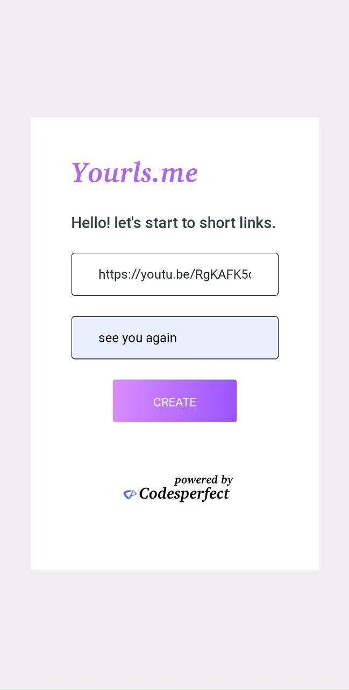

# [**Yourls.me**](https://yourls.me) (Version 1.0.0)

#### Powered By Codesperfect.com

---


 - Online URL shortner web application using NodeJs.

## **Get Started**
- [Software used](#software-used)
- [Installation](#installation)
- [Screenshots](#screenshots)
- [Running Webapp](#running-webapp)
- [License](#license)
  

### **Software Used**
---
Theese requirements are tested in linux operating system.(check windows with yourself).
    
    NodeJs - ExpressJs,Ejs,pg
    Database - Postgresql

### **Installation**
---
Run this command in terminal to install requirements. 
```
git clone https://github.com/codesperfect/yourlsdotme.git
cd yourlsdotme
npm install
```
### **Screenshots**
---




### **Running Webapp**
---
Before running webapp make sure that you have updated Postgres database username,password and database name in app.js file.
```cmd
cd yourlsdotme

npm start
```

---

<br>

# **License**
```
MIT License

Copyright (c) 2022 M Praveen

Permission is hereby granted, free of charge, to any person obtaining a copy
of this software and associated documentation files (the "Software"), to deal
in the Software without restriction, including without limitation the rights
to use, copy, modify, merge, publish, distribute, sublicense, and/or sell
copies of the Software, and to permit persons to whom the Software is
furnished to do so, subject to the following conditions:

The above copyright notice and this permission notice shall be included in all
copies or substantial portions of the Software.

THE SOFTWARE IS PROVIDED "AS IS", WITHOUT WARRANTY OF ANY KIND, EXPRESS OR
IMPLIED, INCLUDING BUT NOT LIMITED TO THE WARRANTIES OF MERCHANTABILITY,
FITNESS FOR A PARTICULAR PURPOSE AND NONINFRINGEMENT. IN NO EVENT SHALL THE
AUTHORS OR COPYRIGHT HOLDERS BE LIABLE FOR ANY CLAIM, DAMAGES OR OTHER
LIABILITY, WHETHER IN AN ACTION OF CONTRACT, TORT OR OTHERWISE, ARISING FROM,
OUT OF OR IN CONNECTION WITH THE SOFTWARE OR THE USE OR OTHER DEALINGS IN THE
SOFTWARE.
```
---

# **Thank You 😊**
